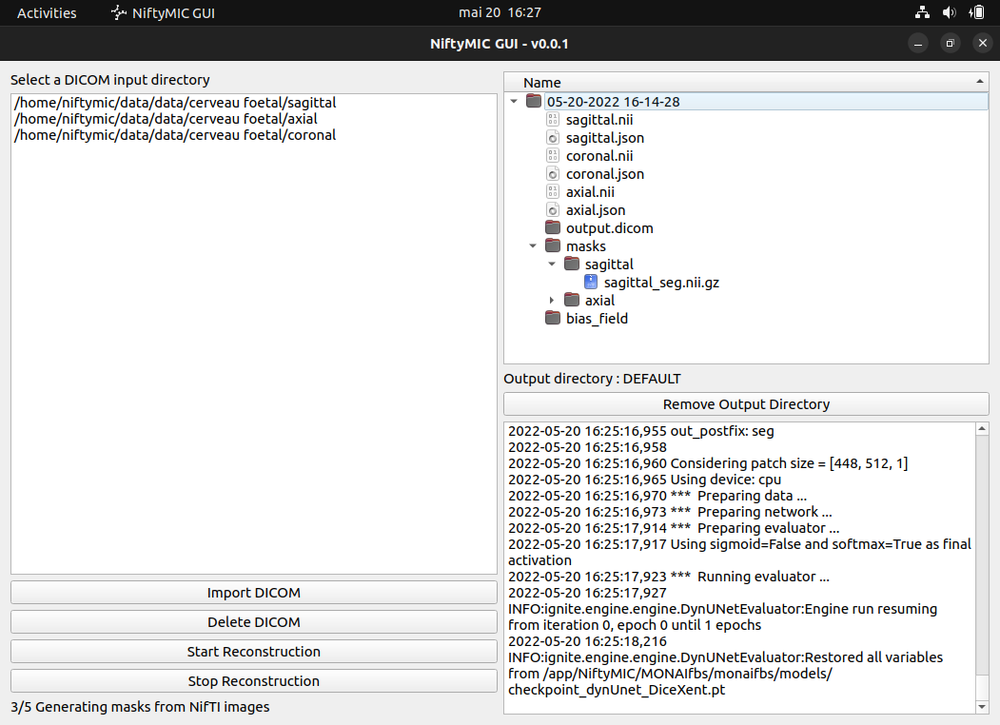

# NiftyMIC GUI

These scripts create a PyQT5 interface to allow uninitiated users to use NiftyMIC MRI
reconstruction algorithm.

https://github.com/gift-surg/NiftyMIC

## Prerequisites

You need Docker to use the docker image of NiftyMIC : https://hub.docker.com/r/renbem/niftymic
* Use docker in rootless mode by following this tutorial : https://docs.docker.com/engine/security/rootless/

[`dcm2niix`](https://github.com/rordenlab/dcm2niix) is use to convert DICOM to NifTI format, required by NiftyMIC.
`medcon` is use to convert NifTI output to DICOM after reconstruction.

Install PyQt5 dependencies on Ubuntu 22.04:

```bash
sudo apt-get install -y qtbase5-dev qtchooser qt5-qmake qtbase5-dev-tools medcon
```

## Installation

```bash
pip install niftymic-gui
```

To install the desktop shortcut on Ubuntu

```bash
sudo desktop-file-install scripts/NiftyMIC_GUI.desktop
```

## Demo

